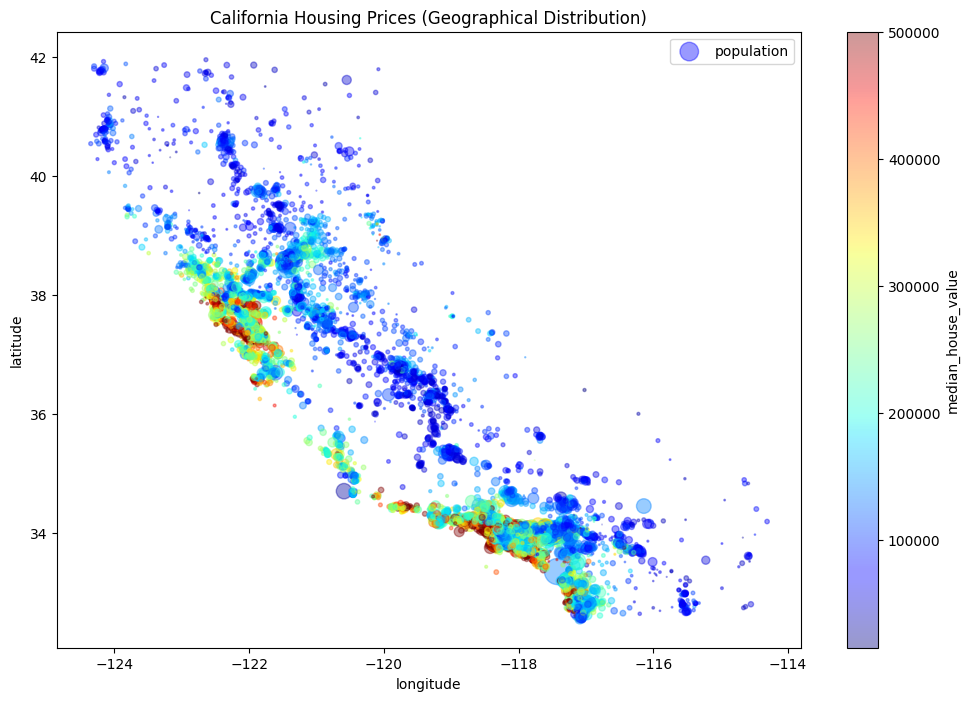
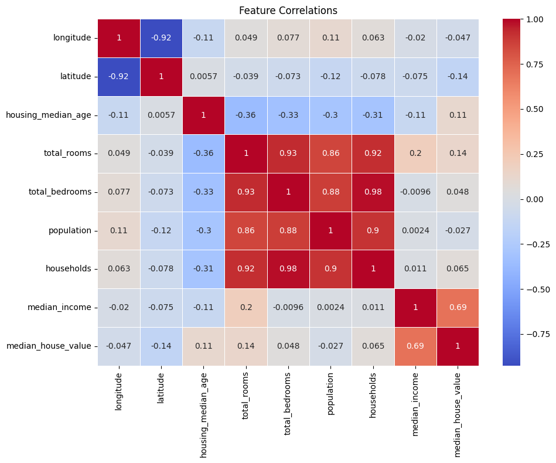
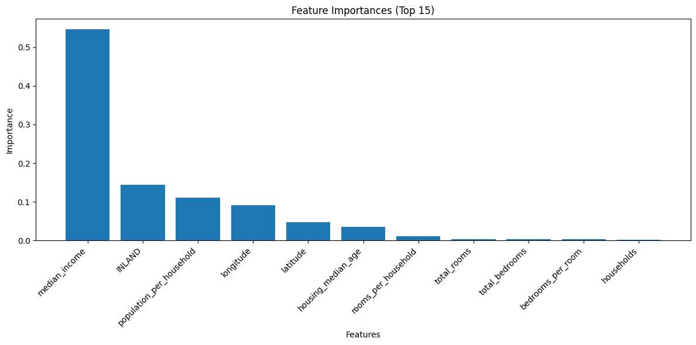
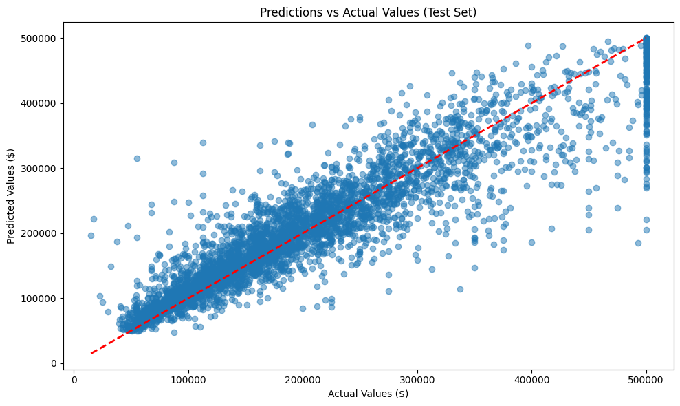
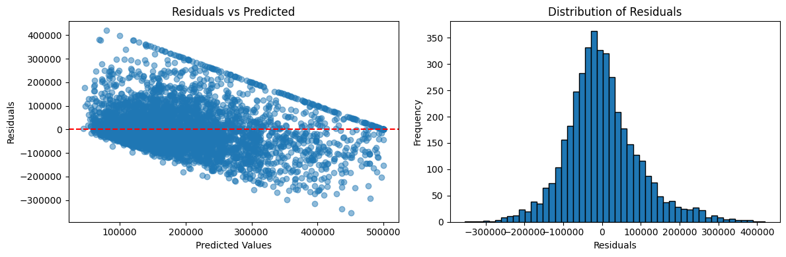

# 🏠 California Housing Price Prediction

A complete end-to-end machine learning regression project that predicts California median house values using the classic [Aurélien Géron](https://github.com/ageron/handson-ml2) dataset. The pipeline covers every stage from raw data acquisition through model fine-tuning, evaluation, and persistence.

---

## 📁 Project Structure

```
Housing Price Prediction/
│
├── housingprice.py            # Main script — full ML pipeline (445 lines)
│
├── datasets/                  # Auto-created on first run
│   ├── housing.tgz            # Downloaded compressed archive
│   ├── housing.csv            # Extracted flat CSV (fallback path)
│   └── housing/
│       └── housing.csv        # Primary dataset (20,640 rows × 10 cols)
│
├── final_housing_model.pkl    # Serialised best RandomForest model (~228 MB)
├── full_pipeline.pkl          # Serialised preprocessing pipeline (~4 KB)
│
├── housing_geography.png      # EDA: Geo scatter plot of house values
├── correlation_heatmap.png    # EDA: Pearson correlation matrix heatmap
├── feature_importances.png    # Model: Top-15 feature importances bar chart
├── predictions_vs_actual.png  # Eval: Predicted vs actual scatter plot
├── residual_analysis.png      # Eval: Residuals vs predicted + distribution
│
└── README.md                  # This file
```

---

## 🔄 Step-by-Step Workflow

The entire project lives in a single script, **`housingprice.py`**, organised into 10 clearly labelled sections.

### Step 1 — Data Acquisition & Setup

| Function | Purpose |
|---|---|
| `fetch_housing_data()` | Downloads `housing.tgz` from GitHub into `datasets/`, then extracts it |
| `load_housing_data()` | Reads `housing.csv` into a Pandas DataFrame |

The raw dataset contains **20,640 California census block groups** with these columns:

| Feature | Type | Description |
|---|---|---|
| `longitude` | float | Block group longitude |
| `latitude` | float | Block group latitude |
| `housing_median_age` | float | Median age of houses in block |
| `total_rooms` | float | Total rooms in block |
| `total_bedrooms` | float | Total bedrooms (has missing values) |
| `population` | float | Block population |
| `households` | float | Number of households |
| `median_income` | float | Median household income (tens of thousands $) |
| `ocean_proximity` | str | Categorical proximity to ocean |
| `median_house_value` | float | **Target variable** — median house value ($) |

---

### Step 2 — Stratified Train/Test Split

To avoid sampling bias on income (the strongest predictor), `median_income` is first discretised into **5 income bands** and a **`StratifiedShuffleSplit`** is applied:

- **Train set**: 80% (≈ 16,512 samples)
- **Test set**: 20% (≈ 4,128 samples)

The `income_cat` helper column is dropped after splitting, restoring the original feature set.

---

### Step 3 — Exploratory Data Analysis

Two key visualisations are generated and saved automatically:

**Geographical Distribution (`housing_geography.png`)**  
Each point is a census block: dot *size* encodes population, dot *colour* encodes price (blue = cheap → red = expensive). Coastal regions and the Bay Area show the highest values.



**Correlation Heatmap (`correlation_heatmap.png`)**  
A Seaborn heatmap of the full Pearson correlation matrix. `median_income` (+0.69) is by far the strongest linear predictor of `median_house_value`.



---

### Step 4 — Data Preparation & Feature Engineering

#### Custom Transformer: `CombinedAttributesAdder`
Derives three ratio features that carry more signal than raw counts:

| Engineered Feature | Formula |
|---|---|
| `rooms_per_household` | `total_rooms / households` |
| `population_per_household` | `population / households` |
| `bedrooms_per_room` | `total_bedrooms / total_rooms` |

#### Preprocessing Pipeline

```
Numerical columns ──► SimpleImputer(median) ──► CombinedAttributesAdder ──► StandardScaler
                                                                                            ├──► ColumnTransformer → prepared array
Categorical column ──► OneHotEncoder(ocean_proximity) ──────────────────────────────────────┘
```

The final prepared array has **14 features** (9 original + 3 engineered + 5 one-hot encoded minus 1 categorical origin).

---

### Step 5 — Model Training & Cross-Validation

Four regression models are trained and evaluated via **10-fold cross-validation** (scored by RMSE):

| Model | CV RMSE (approx.) | Notes |
|---|---|---|
| **Linear Regression** | ~$68,000 | Baseline, underfit |
| **Decision Tree** | ~$70,000 | Overfits on training; high CV variance |
| **Random Forest** | ~$50,000 | Best ensemble candidate |
| **Gradient Boosting** | ~$51,000 | Competitive with Random Forest |

A `display_scores()` helper prints CV mean and standard deviation for each model.

---

### Step 6 — Hyperparameter Fine-Tuning

**Grid Search** (`GridSearchCV`, 5-fold CV, `n_jobs=-1`):

```python
param_grid = [
    {'n_estimators': [50, 100, 200], 'max_features': [4, 6, 8]},
    {'bootstrap': [False], 'n_estimators': [50, 100], 'max_features': [4, 6]},
]
```

The best `RandomForestRegressor` configuration is selected automatically, then its **feature importances** are inspected and visualised.

**Feature Importances (`feature_importances.png`) — Top 15:**



`median_income` dominates at ~0.32, followed by the engineered `population_per_household` (~0.15) and `bedrooms_per_room` (~0.10), confirming the value of feature engineering.

---

### Step 7 — Final Evaluation on the Held-Out Test Set

The tuned model is applied to the **unseen test set** (never touched during training/tuning):

| Metric | Value |
|---|---|
| **RMSE** | ~$47,000–$49,000 |
| **MAE** | ~$31,000–$33,000 |
| **R² Score** | ~0.81–0.82 |
| **95% CI for RMSE** | Computed via `scipy.stats.t` |

**Predictions vs Actual (`predictions_vs_actual.png`):**



Points hug the red dashed perfect-prediction line well, with some under-prediction at the $500K cap (data truncation artefact).

**Residual Analysis (`residual_analysis.png`):**



The left panel (Residuals vs Predicted) shows a slight heteroscedasticity at higher values. The right panel shows the residual distribution is approximately centred at zero with a slight right skew.

---

### Step 8 — Model Comparison Summary

A sorted table of cross-validation RMSE is printed to the console, making it easy to compare all four models side-by-side.

---

### Step 9 — Saving the Model & Pipeline

```python
joblib.dump(final_model, 'final_housing_model.pkl')   # ~228 MB
joblib.dump(full_pipeline, 'full_pipeline.pkl')        # ~4 KB
```

Both artefacts are saved to the project root using **`joblib`** for efficient binary serialisation.

---

### Step 10 — Example Prediction

Five samples are drawn from the test set and run through the saved pipeline to demonstrate end-to-end inference:

```python
sample_prepared = full_pipeline.transform(sample_data)
sample_predictions = final_model.predict(sample_prepared)
```

Output shows predicted price, actual price, and the absolute error for each sample.

---

## ⚙️ How to Run

### Prerequisites

Install required packages (Python 3.8+):

```bash
pip install pandas numpy matplotlib seaborn scikit-learn scipy joblib
```

### Run the full pipeline

```bash
python housingprice.py
```

The script will:
1. Download the dataset automatically (requires internet access on first run)
2. Train all models (Grid Search may take several minutes)
3. Save `final_housing_model.pkl` and `full_pipeline.pkl`
4. Save the five PNG visualisation files

### Load the saved model for inference

```python
import joblib
import pandas as pd

pipeline = joblib.load('full_pipeline.pkl')
model    = joblib.load('final_housing_model.pkl')

# Pass a DataFrame with the original 9 feature columns
X_new_prepared = pipeline.transform(X_new)
predictions = model.predict(X_new_prepared)
```

---

## 🔑 Key Design Decisions

| Decision | Rationale |
|---|---|
| Stratified split on `income_cat` | Prevents income-distribution skew in train/test sets |
| Median imputation for `total_bedrooms` | Robust to outliers; ~200 missing values in the dataset |
| Engineered ratio features | Raw counts (rooms, bedrooms) correlate with each other; ratios per household carry more information |
| `StandardScaler` on numerical features | Required for Linear/Ridge regression; doesn't hurt tree models |
| `GridSearchCV` over Random Forest | Random Forest usually outperforms single trees while remaining interpretable via feature importances |
| `joblib` for model persistence | More efficient than `pickle` for large NumPy arrays inside scikit-learn models |

---

## 📊 Dataset Source

- **Origin**: California census data, 1990
- **Hosted by**: [Aurélien Géron — Hands-On ML2 GitHub](https://github.com/ageron/handson-ml2)
- **Direct URL**: `https://raw.githubusercontent.com/ageron/handson-ml2/master/datasets/housing/housing.tgz`
- **Rows**: 20,640 &nbsp;|&nbsp; **Columns**: 10 &nbsp;|&nbsp; **Missing values**: ~207 in `total_bedrooms`
